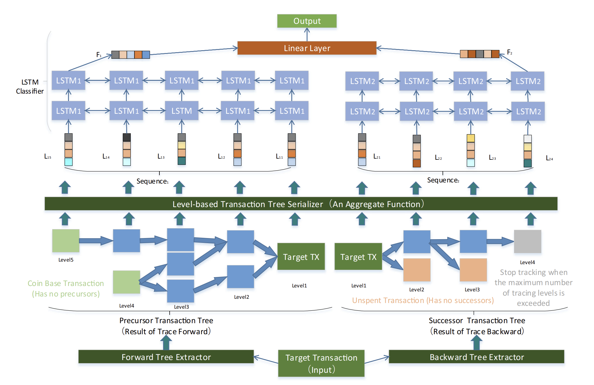

# LSTM-TC

LSTM-TC is a classifier for bitcoin transaction tree. The input is bitcoin transaction.

1. Tree Extractor: `Transaction` -> `Tree Data` 

   Data: Tree data for 264,960 transactions 

2. Level-based Transaction Tree Serializer: `Tree Data` -> `Processed Features`

   Source code: `Level-based Transaction Tree Serializer`: Two implementations in C++ and go are provided. C++ is more memory efficient.

   Data: Processed Features: 264,960 transactions

   You can skip this step and use `Processed Features` we sheared.

3. LSTM Classifier

   Source code: `LSTM-TC Classifier.ipynb` 

## System Overview




## Reference

Our [paper](https://link.springer.com/article/10.1007/s10489-021-02453-9) published in Applied Intelligence.

```
@article{sun2021lstm,
  title={LSTM-TC: Bitcoin coin mixing detection method with a high recall},
  author={Sun, Xiaowen and Yang, Tan and Hu, Bo},
  journal={Applied Intelligence},
  pages={1--14},
  year={2021},
  publisher={Springer}
}
```